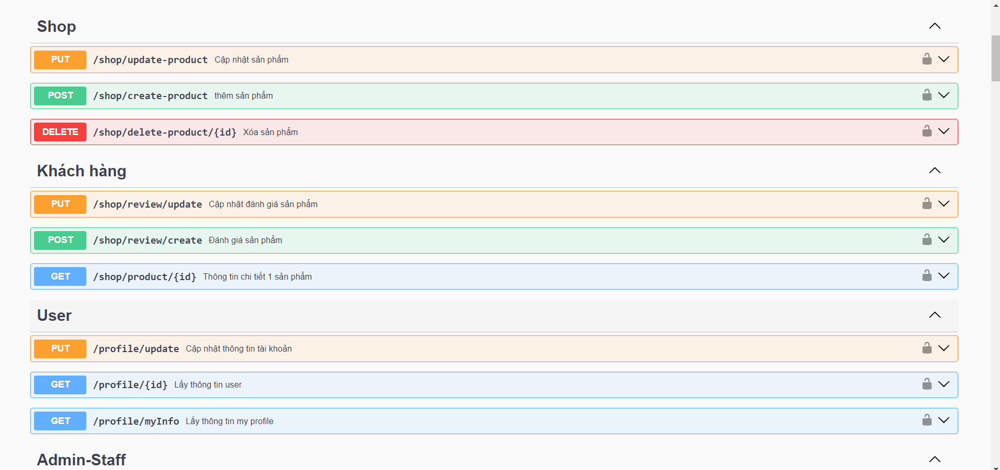
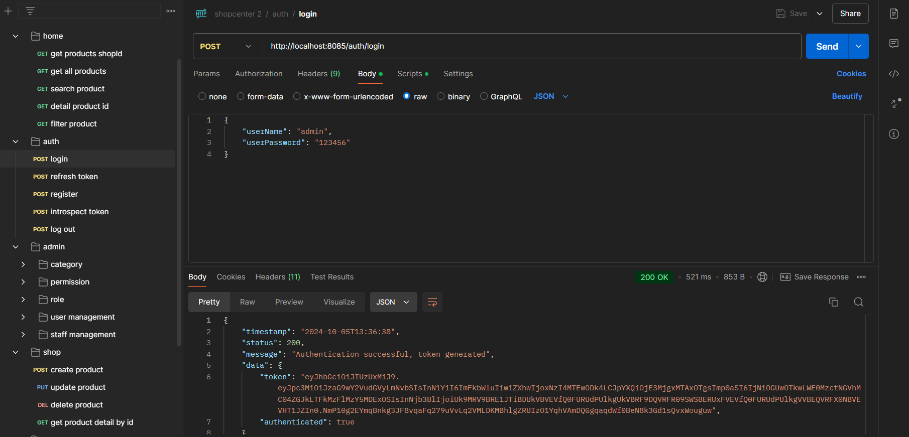

## Hướng dẫn kiểm tra API
Để kiểm tra các API, bạn có thể làm theo các bước sau:

1. **Sử dụng Swagger UI:** Truy cập vào Swagger UI tại `http://localhost:8085/swagger-ui/index.html` để xem và thử nghiệm các endpoint.
- 

2. **Sử dụng Postman**
- 
